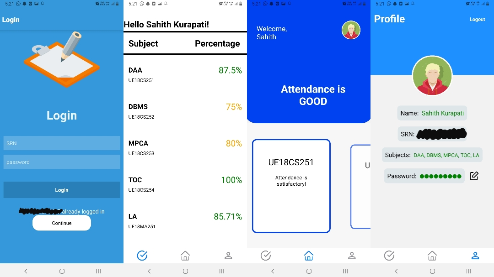

# automated-attendance-manager-react-native

### Introduction
This is the mobile app part of the full automated attendance manager application made with react native.

### Screenshots of the app:

### Functionality of the app:

* full functioning login screen with keyboardAvoidingView and SafeView
* home screen with sticky carousel items
* attendance list screen with styled FlatList component
* student profile screen
* fetches data stored in firebase database in realtime
* uses async-storage-react-native for local storage of username
* has pull-to-refresh functionality
* calculates the number of classes required to make up for a threshold percentage
* opens modal from bottom with smooth 60fps animation for in-depth attendance details (details coming soon)
* in-app password change feature

### Other part of the project:
The other part of the project (web app and face recognition) can be found [here](https://github.com/Sahith02/automated-attendance-manager-web-app)